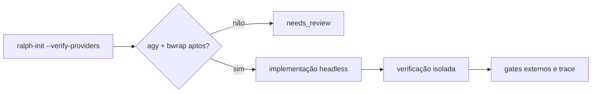

# Adapter nativo `agy` para o Ralph Method

> **Versão**: 1.0.0
> **Status**: Aprovado para implementação
> **Criado em**: 2026-08-14
> **Atualizado em**: 2026-08-14
> **Autor**: Ralph Method

---

## Tese do produto

> Tornar o Antigravity CLI um quarto runner executável do Ralph Method sem reduzir as garantias de gates, identidade, isolamento e ausência de fallback silencioso.

## Hero Flow

Um mantenedor instala o Ralph Method em um projeto Linux, solicita a verificação
explícita do provider `agy`, recebe readiness funcional somente quando CLI,
autenticação, modelo, agente e isolamento estão comprovados e executa uma fase.
O `agy` implementa em uma sessão headless e revisa em outra sessão confinada a
filesystem read-only; o loop aceita a fase apenas após resultado normalizado e
gates externos verdes.



## Resumo executivo

Esta feature reabre o item `agy` adiado pelo ADR-0007 porque agora há demanda
explícita, contrato headless oficial e orçamento de validação. A entrega adiciona
readiness não generativo, adapter fail-closed, normalização de `stream-json`,
perfil instalável e integração ao loop. A segurança de verificação não depende
de `--mode plan`: em `agy 1.1.13` essa flag permitiu uma escrita real. A v1 usa
`bwrap` no Linux para tornar a raiz visível somente para leitura, substitui os
settings globais por `allowNonWorkspaceAccess=false` e mantém `plan`, sandbox e
um agente strict/MCP-off como defesas adicionais.

## 1. Problema

### O problema

O Ralph detecta `agy`, mas o classifica como unsupported e não possui caminho de
execução. Tentar `--engine agy` é rejeitado no preflight; sem a validação, uma
integração ingênua também poderia tratar saída `result` como `step_finish` ou
confiar incorretamente em `--mode plan` como sandbox read-only.

### Quem tem o problema

Mantenedores técnicos que já possuem uma sessão Antigravity autenticada e querem
usar seus modelos no mesmo loop determinístico de fases, testes e revisão do
Ralph Method.

### Solução atual e limitações

- usar Codex, Claude ou OpenCode, mesmo quando `agy` é o provider desejado;
- chamar `agy` fora do control plane, perdendo normalização e gates;
- manter scripts locais sem contrato de instalação, readiness ou isolamento.

### Por que agora

O gatilho do ADR-0007 foi satisfeito: necessidade de produto explícita, CLI
headless estável e janela para fixture offline, smoke real e prova adversarial.

## 2. Usuários e persona

### Usuário primário: mantenedor do projeto-alvo

| Atributo | Descrição |
|---|---|
| Papel | engenheiro responsável pelo loop local |
| Nível técnico | avançado |
| Objetivo | executar fases com `agy` sem perder controles do Ralph |
| Dores | integração inexistente, segurança ambígua e saída não normalizada |
| Sucesso | impl + verify + gates concluídos com identidade e evidência sanitizadas |

Usuários secundários são os mantenedores do próprio Ralph, que precisam de um
contrato reproduzível e regressões sem credenciais.

## 3. Visão da solução

### Abordagem

- certificar `agy models` e `agy --add-dir <repo-root> agents` como probes não
  generativos;
- implementar `adapters/agy/` com `preflight`, `run`, `version`, parser e política;
- usar `stream-json` e reconhecer `result` como terminal;
- executar `impl` com permissões explícitas e `verify` em isolamento `bwrap`;
- instalar agente de workspace e perfil `.ralph/agy.env` por ownership;
- integrar `agy` por uma seam comum de adapters sem alterar a autoridade do controlador.

### Diferenciais

- fail-closed sobre eventos, modelo, sessão e ferramentas de verificação;
- sandbox com allowlist de filesystem; o restante do host não é montado;
- settings globais do Antigravity ocultos e substituídos por file access
  restrito ao workspace durante a revisão;
- fallback permanece `none`; esta feature não antecipa `FEATURE-094`.

### Métricas de sucesso

| Métrica | Meta | Medição |
|---|---:|---|
| Fixture offline do adapter | 100% verde | scripts dedicados no CI portátil |
| Mutação da raiz em verify | 0 | prova com canário + isolamento |
| Eventos terminais aceitos | exatamente 1 `result` | parser fail-closed |
| Probes generativos no readiness | 0 | fake CLI rejeita `--print` |
| Regressão obrigatória | 100% verde | comandos de `AGENTS.md` |

## 4. Features e requisitos

### Escopo v1

#### P0.1 — Readiness executável

**User story**: como mantenedor, quero saber se `agy` está realmente apto para
que o instalador não habilite um runner inseguro.

**Critérios de aceitação**:

- [ ] `agy models` comprova autenticação/modelos sem geração;
- [ ] `agy --add-dir <repo-root> agents` comprova exatamente o agente
  `ralph-review` sem geração;
- [ ] ausência de Linux, `bwrap` ou token legível resulta em degraded/disabled;
- [ ] `adapter_enabled=true` exige todos os sinais acima.

#### P0.2 — Adapter headless e parser

**User story**: como mantenedor, quero executar fases via `agy` e receber o
mesmo resultado sanitizado usado pelos outros runners.

**Critérios de aceitação**:

- [ ] runner suporta `preflight`, `run` e `version`;
- [ ] prompt é lido do arquivo, recebe SHA-256 e não vai para ledger/docs;
- [ ] parser valida `init`, uma conversa, modelo e um `result` terminal;
- [ ] JSONL persistido omite resposta, parâmetros e output de ferramentas;
- [ ] gate 3 recebe somente vereditos canônicos de task, sem resposta completa;
- [ ] schema aceita OpenCode `1.0.0` sem mudança e `agy` no contrato comum `1.1.0`;
- [ ] defaults são prompt 256 KiB, stream 5 MiB, 10 mil eventos e 30 minutos.

#### P0.3 — Verificação realmente isolada

**User story**: como mantenedor, quero revisão independente que não consiga
alterar o projeto mesmo se o modelo tentar usar uma ferramenta de escrita.

**Critérios de aceitação**:

- [ ] `verify` exige agente `ralph-review`, `--mode plan` e `--sandbox`;
- [ ] `bwrap` parte de raiz vazia e monta read-only apenas runtime, certificados e projeto;
- [ ] token OAuth, settings restritivo e canário de fronteira são remontados
  read-only no app-data efêmero;
- [ ] settings globais não entram na sessão e
  `allowNonWorkspaceAccess=false` é aplicado;
- [ ] o ambiente é limpo e repõe somente `HOME`, `USER`, `PATH` e locale;
- [ ] qualquer ferramenta, parâmetro desconhecido ou path fora da allowlist
  read-only reprova o resultado;
- [ ] hash da política é calculado sobre superfícies versionadas.

#### P0.4 — Loop e instalação

**User story**: como mantenedor, quero selecionar `--engine agy` pelo perfil
instalado e manter os mesmos gates e trace.

**Critérios de aceitação**:

- [ ] loop despacha OpenCode e `agy` pela mesma interface `preflight|run|version`;
- [ ] gate 0 lê o resultado normalizado do adapter;
- [ ] instalador gerencia adapter, agente e `.ralph/agy.env` atomicamente;
- [ ] uninstall preserva arquivos com drift segundo ownership existente;
- [ ] seleção automática mantém ordem e `fallback_policy=none`.

### Roadmap adiado

| # | Item | Prioridade | Motivo | Gatilho |
|---|---|---|---|---|
| 1 | Isolamento de verify em macOS | P1 | v1 comprovada apenas em Linux | sandbox externo equivalente testado em campo |
| 2 | Métricas de tokens/duração | P2 | não necessárias aos gates | contrato comum de observabilidade aprovado |
| 3 | Participação em failover | P1 | pertence à `FEATURE-094` | failover v2 implementado e certificado |

### Fora de escopo

- alterar máquina de estados, leases, fencing ou gates de `bin/ralph-control`;
- fallback automático ou troca silenciosa de provider;
- persistir respostas completas, prompts ou credenciais;
- criar alias de runner `antigravity` além do identificador canônico `agy`;
- suportar modo TUI/interativo.

## 5. Arquitetura técnica

O adapter vive em `adapters/agy/` e é chamado somente por `scripts/ralph.sh`.
`bin/ralph-init` continua dono da instalação/readiness e `bin/ralph-control`
continua a única autoridade de estado; seu importador aceita a nova matriz
runner/schema/terminal sem alterar transições. O contrato detalhado está
registrado em `docs/architecture/` e nos ADRs 0017–0019.

| Camada | Tecnologia | Justificativa |
|---|---|---|
| Runner | Bash | convenção dos adapters e portabilidade do loop |
| Parser/policy | PHP 8.2+ | runtime já obrigatório do control plane |
| Isolamento verify | `bwrap`/Linux | allowlist de filesystem comprovada localmente |
| Eventos | JSONL `stream-json` | contrato oficial incremental do `agy` |
| Testes | Bash + fixtures PHP | sem credenciais no CI portátil |

Integração externa única: Antigravity CLI `agy`; não há pacote novo vendorizado.

## 6. Experiência operacional

```bash
bin/ralph-init plan --project /projeto --provider agy --verify-providers
bin/ralph-init apply --project /projeto --provider agy --verify-providers
source /projeto/.ralph/agy.env
/projeto/scripts/ralph.sh --engine agy /projeto/.spec/features/x/PHASES.md
```

Não há UI, wireframe, requisito responsivo ou requisito WCAG aplicável.

## 7. Caso de valor

É uma capacidade interna/open source sem receita ou pricing aplicáveis. O
retorno é ampliar a escolha de modelos mantendo um único control plane e
reduzir scripts locais não auditáveis.

## 8. Riscos e mitigações

| Risco | Prob. | Impacto | Mitigação |
|---|---|---|---|
| `plan` permitir mutação | comprovado | alto | `bwrap` read-only + allowlist + fail-closed |
| settings globais liberarem comandos | média | alto | app-data efêmero sem settings globais |
| mudança do JSONL upstream | média | alto | parser estrito + fixture + teste real explícito |
| token indisponível no sandbox | baixa | alto | preflight e bind read-only exato |
| suporte apenas Linux | alta fora do Linux | médio | status degradado e roadmap explícito |
| resposta/stderr vazar dado | média | alto | eventos sanitizados, artefatos 0600 e redaction |

Assume-se `agy >= 1.1` com as flags documentadas, projeto Git, uma execução de
runner por feature sob o lock existente e Linux com user namespaces/bubblewrap
habilitados. A v1 limita cada prompt a 256 KiB, cada stream a 5 MiB, cada sessão
a 10 mil eventos e 30 minutos. Revisitar esses defaults quando 1% das execuções
atingir 80% de qualquer limite em uma janela de 30 dias.

## 9. Estratégia de testes

| Tipo | Escopo | Ferramenta |
|---|---|---|
| contrato | parser, política, schema, limites | Bash/PHP com fake `agy` |
| integração | readiness, instalação, loop | scripts portáteis |
| segurança | ferramenta proibida, canário, settings ocultos | fixture `bwrap` |
| campo | impl e verify reais sanitizados | `agy 1.1.13` opt-in |
| regressão | fronteira de `AGENTS.md` | scripts oficiais |

Edge cases obrigatórios: JSON inválido, múltiplas sessões/resultados, modelo
divergente, `result` não final, timeout, token ausente, `bwrap` ausente,
ferramenta desconhecida e tentativa de escrita.

## 10. Marcos

| Marco | Entrega | Data-alvo |
|---|---|---|
| M1 | contratos, ADR e fases | 2026-08-14 |
| M2 | adapter/readiness/loop e fixtures | 2026-08-14 |
| M3 | regressão, campo e relatório | 2026-08-14 |

## 11. Decisões

| # | Decisão | Escolha | Owner | Racional | Data |
|---|---|---|---|---|---|
| 1 | Identidade | `agy` | Ralph Method | coincide com binário/provider existente | 2026-08-14 |
| 2 | Terminal | `result` | Ralph Method | contrato oficial e evento observado | 2026-08-14 |
| 3 | Read-only | allowlist `bwrap` + `plan` | Ralph Method | `plan` sozinho foi refutado | 2026-08-14 |
| 4 | Plataforma v1 | Linux | Ralph Method | isolamento disponível e comprovável | 2026-08-14 |
| 5 | Schema | OpenCode `1.0.0`; comum `1.1.0` para `agy` | Ralph Method | preserva consumidores e deixa v2 ao failover | 2026-08-14 |
| 6 | Fallback | `none` | Ralph Method | mantém política atual | 2026-08-14 |
| 7 | Seam do loop | contrato comum de adapter | Ralph Method | o gatilho do ADR-0005 disparou com o segundo adapter | 2026-08-14 |

## 12. Questões abertas

Não há questão bloqueante para a v1. O suporte macOS permanece item de roadmap,
não ambiguidade da implementação atual.

## Apêndice

### Glossário

| Termo | Definição |
|---|---|
| `agy` | binário da Antigravity CLI |
| `bwrap` | Bubblewrap, isolamento de mount namespace no Linux |
| policy hash | SHA-256 das superfícies versionadas da política de verify |

### Referências

- [SPEC da feature](../../.spec/features/095-agy-adapter/SPEC.md)
- [Documentação headless oficial](https://antigravity.google/docs/cli/headless)
- [Documentação de permissões](https://antigravity.google/docs/cli/permissions)
- [ADR-0007](../adr/0007-escopo-fechado-de-harnesses.md)

### Change log

| Versão | Data | Alteração |
|---|---|---|
| 1.0.0 | 2026-08-14 | PRD inicial aprovado para implementação |
